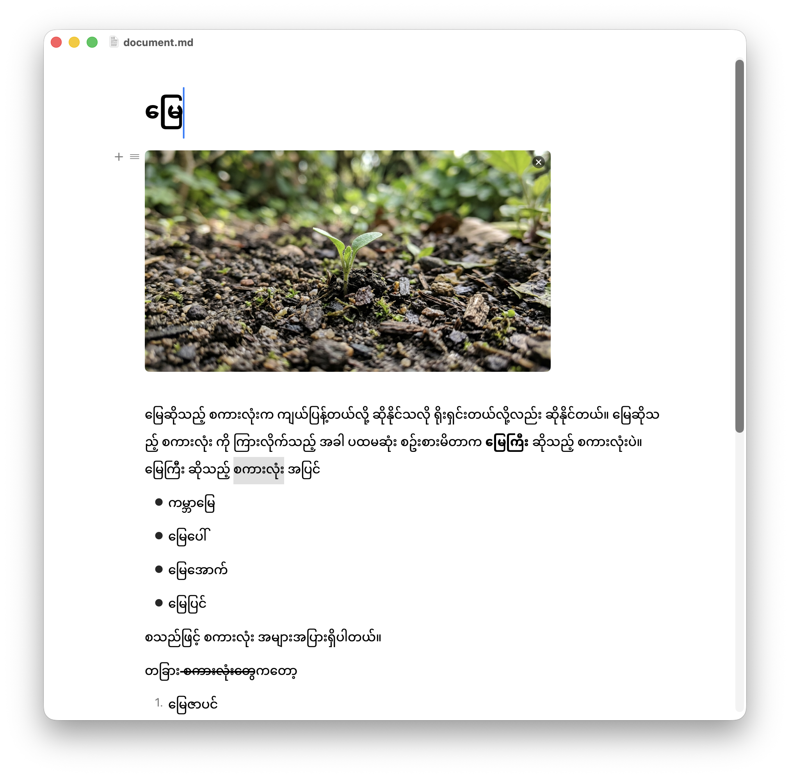

# MyaeEditor

A native macOS block editor built with SwiftUI. Write in
rich blocks — headings, lists, to-dos, tables, code, math — and save straight to
Markdown.



## Features

- **Block-based editing** — paragraphs, H1–H3, bulleted / numbered / to-do lists,
  quotes, dividers.
- **Slash menu** — type `/` to insert any block type.
- **Floating format bar** — select text for bold, italic, strikethrough, and
  inline code.
- **Code blocks** — syntax highlighting for Swift, Python, JavaScript,
  TypeScript, JSON, HTML, CSS, Shell, Go, Rust, C, C++, Java, Ruby, SQL, YAML.
- **Tables** — add/remove rows and columns with a per-cell context menu.
- **Math** — inline math and block equations (LaTeX-style rendering).
- **Images** — inline image blocks.
- **Drag to reorder** — grab a block and move it; marquee-select across blocks.
- **Markdown I/O** — Open (`⌘O`), Save (`⌘S`), Save As Markdown (`⇧⌘S`).

## Requirements

- macOS 26.5+
- Xcode 16+ (uses synchronized project folders)
- Swift 5

## Getting Started

```bash
open MyaeEditor.xcodeproj
```

Then build and run (`⌘R`) with the **MyaeEditor** scheme. Or from the CLI:

```bash
xcodebuild -project MyaeEditor.xcodeproj -scheme MyaeEditor \
  -destination 'platform=macOS' build
```

## Architecture

SwiftUI **MV (Model-View)** — no ViewModels. `@Observable` model classes are the
single source of truth and views bind to them directly via `@State`. Stateless
logic (Markdown encode/decode, syntax highlighting) lives in `Services/`.

```
MyaeEditor/
├── App/        MyaeEditorApp.swift          App entry + menu commands
├── Models/     Models.swift                    @Observable: Block, TableData, EditorDocument
├── Services/   MarkdownCodec.swift             Markdown <-> blocks, document store
│               SyntaxHighlighter.swift         Tokenizer + code highlighting
└── Views/      ContentView, EditorView         Main editor surface
                BlockRowView, BlockTextView     Block rendering + text input (NSTextView)
                BlockActionMenu, SlashMenu      Block insertion / actions
                FormatBar                       Floating inline-format toolbar
                TableBlockView, ImageBlockView  Rich block types
                InlineMath                       Math editing + rendering
```

### Why MV, not MVVM

`Block`, `TableData`, and `EditorDocument` are `@Observable` classes held
directly by views (`@State private var document: EditorDocument`). Mutating a
model updates the UI automatically — no `ObservableObject`, no `@Published`, no
ViewModel indirection. This keeps the layers thin (KISS): models hold state,
views mutate them, services stay stateless.

## How the Editor Works

The whole document is just an **ordered array of `Block` objects** on
`EditorDocument`. `EditorView` renders that array and mutates it — there is no
tree, no separate model per view. Everything below flows from those two types.

### The `Block` object

A `Block` (`Models/Models.swift`) is one editable line/element. It is an
`@Observable` class, so editing any field re-renders just the views that read it:

| Field       | Meaning                                             |
| ----------- | --------------------------------------------------- |
| `id`        | Stable `UUID` — used for `ForEach`, drag, selection |
| `kind`      | `BlockKind` (paragraph, heading, list, code, …)     |
| `text`      | `NSAttributedString` — the rich text (bold/italic)  |
| `checked`   | To-do checkbox state                                |
| `depth`     | Indentation level (0 = top-level nesting)           |
| `language`  | Code-block language for syntax highlighting         |
| `table`     | `TableData` when `kind == .table`                   |
| `imagePath` | Relative image path when `kind == .image`           |

The block's **position is not stored on the block** — order is simply its index
in `document.blocks`. That is what makes reordering trivial.

### `EditorDocument` — the single source of truth

`EditorView` holds one `@State private var document: EditorDocument`. The
document owns:

- `blocks: [Block]` — the ordered content.
- `focusedBlockID` / `focusAtStart` — which block gets the keyboard caret, and
  whether the caret lands at the start (used after merges/deletes).
- `selectedBlockIDs` — block-level selection (marquee / `⌘A`).
- `pendingCaretLocation` — a one-shot request to place the caret at an exact
  offset (used when Backspace merges two blocks).
- `autosaveSignal` — a debounced Combine publisher (fires ~2s after the last
  edit). Every mutation calls `markEdited()`, which drives autosave.

All edits go through document methods (`insertBlock`, `deleteAndFocusPrevious`,
`mergeIntoPrevious`, `changeKind`, `duplicate`, `indent`/`outdent`, `move…`).
Views call these; they never reorder the array by hand.

### Sorting / reordering (drag-to-reorder)

Reordering is **index math on `document.blocks`** driven by a drag gesture:

1. Each visible row publishes its frame via a SwiftUI `PreferenceKey`
   (`RowFramePreference`) into `rowFrames: [UUID: CGRect]`. To stay cheap, frames
   are only measured while a drag or marquee is active (`framesActive`).
2. On drag, `reorder(toY:)` walks the *other* blocks and finds the first one
   whose vertical midpoint is below the pointer — that index becomes the drop
   slot.
3. It early-returns if the target slot hasn't actually changed (avoids churn),
   then calls `document.move(id:toIndexAmongOthers:)` inside a `withAnimation`.
4. `move(id:toIndexAmongOthers:)` removes the dragged block and re-inserts it at
   the clamped index — the array *is* the order, so the UI updates automatically.

Because rows use a `LazyVStack`, only on-screen rows have frames; reordering
targets what the user can actually see (there's no drag auto-scroll).

### Focus & caret flow

Views don't fight over focus. A mutation sets `focusedBlockID` (and optionally
`focusAtStart` or `pendingCaretLocation`); `BlockTextView` observes those and
moves the real `NSTextView` caret. Example: pressing Backspace at the start of a
block calls `mergeIntoPrevious`, which appends the text, removes the block, and
sets `pendingCaretLocation` to the join offset so the caret lands exactly where
the two blocks met.

### Block-level selection

Dragging across the margins (marquee) or pressing `⌘A` sets `selectedBlockIDs`
and drops text focus. A global key monitor in `EditorView` then routes
Copy/Cut/Delete/Escape to whole-block operations — copy serializes the selected
blocks back to Markdown via `MarkdownCodec`.

Selection can also start as a normal text drag and escalate: a `BlockTextView`
drag that crosses its own block's edge switches from character selection to
whole-block selection (via a custom `NSTextView` event-tracking loop), and
dragging back de-escalates while keeping the original anchor — a Notion-style
cross-block select.

### Popups

Two SwiftUI `.popover`s hang off each block row (`BlockRowView`), so they float
next to the block that opened them and dismiss on outside-click.

**The `/` command menu (`SlashMenu`)** — insert a block type:

- Typing `/` on an empty-ish line calls `onSlash`, which sets `showSlashMenu`
  and opens the popover below the caret (`arrowEdge: .bottom`).
- As you keep typing, `syncSlashMenuQuery()` reads the text *after* the `/` and
  feeds it to the menu as a live filter — so filtering works even though the
  caret stays in the block, not in the popup's search field.
- The menu filters `BlockKind.allCases` by title/name, is fully keyboard-driven
  (`↑`/`↓` to move, `Return` to pick, `Esc` to cancel), and wraps around.
- Picking a kind strips the `/query` text and converts the block. Each row shows
  the type's icon, title, and subtitle.

**The block action menu (`BlockActionMenu`)** — act on an existing block:

- Every row shows a drag handle (`=`) on hover. **Click** it → opens this
  popover (`arrowEdge: .leading`); **drag** it → reorders (same handle, two
  gestures).
- It's a searchable action list: a **"Turn into"** section (convert between text
  kinds via `changeKind`), **Duplicate**, and **Delete**.
- It adapts to the block type — e.g. a table block adds **Header row / Header
  column** toggles bound straight to that block's `TableData`.
- Typing in its search field filters actions and hides section headers.

Both popups share the same look (material background, rounded corners, subtle
shadow) and auto-focus their search field on open.

### Persistence

`MarkdownCodec.encode` turns `document.blocks` into Markdown;
`MarkdownCodec.decode` turns Markdown back into `[Block]`. Autosave writes to the
open `.md` file (or the local `DocumentStore`) only when the serialized output
actually changed.

## Keyboard Shortcuts

| Action                         | Shortcut |
| ------------------------------- | -------- |
| Open                           | `⌘O`     |
| Save                           | `⌘S`     |
| Save As Markdown               | `⇧⌘S`    |
| Insert block                   | `/`      |
| Bold (text selected)           | `⌘B`     |
| Italic (text selected)         | `⌘I`     |
| Inline code (text selected)    | `⌘E`     |
| Strikethrough (text selected)  | `⇧⌘S`    |

## Tests

- `MyaeEditorTests/` — unit tests
- `MyaeEditorUITests/` — UI tests

## License

MIT — see [LICENSE](LICENSE).
